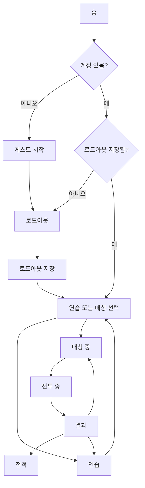
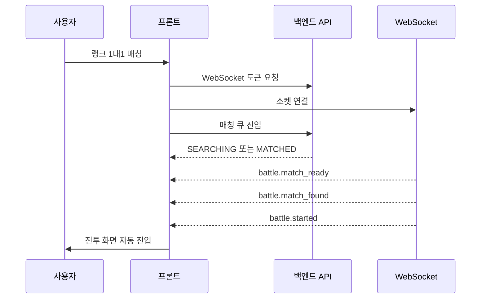

# v5 연습모드와 매칭 플로우 기획

## 목적

기존 화면에는 `홈`, `로드아웃`, `연습모드`, `매칭`, `전투`, `결과`, `전적`이 같은 탭 위계로 노출되어 있었다. 하지만 실제 제품 흐름에서 `매칭`, `전투`, `결과`는 사용자가 자유롭게 들어가는 목적지가 아니라, 버튼과 서버 이벤트에 의해 진행되는 런타임 상태다.

v5의 목표는 사용자가 "어디를 눌러야 다음 단계로 가는지"를 고민하지 않도록 연습모드와 매칭의 관계를 다시 설계하는 것이다.

## 기존 문제와 반영 결과

기존 연습모드는 왼쪽 탭의 `연습모드`에 있으며, 홈 화면 내부의 `연습모드 시작` 버튼으로도 이동할 수 있었다. 이 구조는 기능적으로 존재하지만, 탭 이동과 내부 버튼 이동이 같은 역할을 하면서 플로우가 불명확해졌다.

기존 구조의 문제는 다음과 같았다.

- `매칭`, `전투`, `결과`가 사용자가 직접 들어갈 수 있는 화면처럼 보인다.
- 홈 내부 버튼과 왼쪽 탭이 같은 이동을 중복 제공한다.
- `매칭` 탭을 누르면 큐에 들어가는 것인지, 큐 상태를 보는 것인지 알기 어렵다.
- `전투`와 `결과`는 active battle이나 ended battle이 없으면 목적지가 될 수 없다.
- 연습모드는 선택적 준비 활동인데, 매칭과 같은 위계에 있어 필수 단계처럼 보일 수 있다.

## 제품 원칙

이 프로젝트는 단순 탭 기반 관리 화면이 아니라 상태 기반 플레이 플로우다. 따라서 화면은 아래 두 종류로 분리한다.

### 사용자가 직접 방문하는 목적지

| 목적지 | 역할 |
| --- | --- |
| 홈 | 현재 상태를 요약하고 다음 행동 하나를 제안하는 시작 허브 |
| 로드아웃 | 매칭에 사용할 공식 술식/연출 설정 |
| 연습 | 선택한 술식의 손동작을 안전하게 반복하는 공간 |
| 전적 | 완료된 전투 결과, 레이팅, 리더보드 확인 |

### 시스템이 자동으로 진입시키는 진행 상태

| 진행 상태 | 진입 조건 |
| --- | --- |
| 매칭 중 | 사용자가 `랭크 1대1 매칭`을 누르고 큐 진입에 성공 |
| 전투 중 | 서버가 `battle.started` 이벤트를 보냄 |
| 결과 | 서버가 전투 종료 이벤트를 보냄 |

v5 구현에서는 왼쪽 탭을 `홈`, `로드아웃`, `연습`, `전적` 중심으로 축소했다. `매칭 중`, `전투 중`, `결과`는 탭이 아니라 상단 진행 표시와 상태 화면으로 표현한다.

## 전체 플로우

## 홈 플로우

홈은 모든 행동을 다 보여주는 화면이 아니라, 현재 상태에서 가장 자연스러운 다음 행동을 하나만 크게 보여준다.

| 사용자 상태 | Primary CTA | Secondary CTA | 안내 |
| --- | --- | --- | --- |
| 계정 없음 | 게스트 시작 | 없음 | 게스트 생성 후 연습과 매칭을 사용할 수 있음 |
| 계정 복구 중 | 불러오는 중 | 없음 | 저장된 플레이어를 복구 중 |
| 계정 있음, 로드아웃 없음 | 로드아웃 설정하기 | 연습 | 매칭에는 저장된 로드아웃 필요 |
| 계정 있음, 로드아웃 있음 | 랭크 1대1 매칭 | 연습, 로드아웃 편집 | 바로 매칭 가능 |
| 큐 대기 중 | 큐 취소 | 없음 | 매칭 중 상태 유지 |
| 전투 중 | 전투로 돌아가기 | 없음 | 이탈 후에도 전투 상태 복구 |
| 결과 확인 가능 | 결과 보기 | 전적 보기 | 직전 결과 확인 가능 |

## 연습 플로우

연습은 매칭 전 필수 단계가 아니다. 사용자가 손동작을 익히는 선택적 준비 모드다.

### 진입 조건

- 게스트 또는 저장된 플레이어 세션이 있어야 한다.
- 저장된 로드아웃은 없어도 진입할 수 있다.
- 브라우저 카메라 권한이 필요하다.

### 화면 구조

| 영역 | 역할 |
| --- | --- |
| 대형 카메라 프리뷰 | 손 검출과 현재 입력 상태를 가장 크게 표시 |
| 연습 상태 배지 | `연습 준비`, `연습 중`, `연습 완료`, `권한 차단` |
| 목표 순서 | 선택한 술식의 손동작 순서와 현재 단계 |
| 진행률 | 전체 sequence 완료 정도 |
| 현재 입력 | 현재 인식 토큰, 손 검출 상태, 신뢰도 |
| 술식 선택 | 연습할 술식을 고르는 보조 패널 |

### 동작 원칙

- 연습은 프론트 로컬 진행만 갱신한다.
- 연습 결과는 서버 전투 판정, 레이팅, 전적에 영향을 주지 않는다.
- 연습에서 선택한 술식과 저장된 로드아웃은 별개로 표시한다.
- 연습 완료 후에는 `다시 연습`, `로드아웃 저장`, `매칭 시작`을 제공한다.

## 매칭 플로우

매칭은 탭으로 들어가는 화면이 아니라 `랭크 1대1 매칭` CTA 이후 자동으로 진입하는 진행 상태다.

### 진입 조건

- 플레이어 세션이 있어야 한다.
- 저장된 로드아웃이 있어야 한다.
- WebSocket 연결이 가능해야 한다.
- 서버 큐에 함께 매칭될 상대가 있어야 전투로 진행된다.

### 단계

### 매칭 화면 원칙

- 매칭 화면은 `큐 대기`, `상대 탐색`, `전투 준비 중` 상태만 보여준다.
- 큐 진입 전에는 매칭 화면을 직접 열지 않는다.
- `SEARCHING` 상태에서는 `큐 취소`를 제공한다.
- `MATCHED` 이후에는 취소를 잠그고 `전투 준비 중`을 표시한다.
- 사용자가 다른 목적지로 이동할 수 있다면 전역 배너에 `매칭 대기 중 · 큐 취소`를 유지한다.

## 전투와 결과 관계

전투는 매칭의 결과로만 진입한다. active battle이 없을 때 사용자가 직접 전투 화면으로 들어가는 경로는 제공하지 않는다.

결과는 전투 종료 직후의 일회성 요약 화면이다. 전적은 영구 기록 화면이다. 결과 화면의 후속 행동 우선순위는 아래 순서로 둔다.

1. 다시 매칭
2. 연습
3. 전적 보기
4. 홈

## 시각 구조 원칙

- 연습에서는 카메라가 1순위다. 카메라는 대형 16:9 영역으로 두고 상태 배지는 카메라 위에 겹쳐 보여준다.
- 전투에서는 전투 보드가 1순위다. 카메라는 입력 장치이므로 하단 보조 패널로 둔다.
- 매칭은 퍼센트 진행률보다 단계형 진행 표시가 적합하다.
- 상태 색상은 `대기=시안`, `성공=그린`, `진행/주의=옐로`, `오류=레드`로 통일한다.
- 디버그 입력은 일반 플레이보다 시각 우선순위를 낮추고, 가능하면 접힘 영역으로 분리한다.

## 구현 반영 결과

| 항목 | v5 구현 결과 | 비고 |
| --- | --- | --- |
| 왼쪽 탭 | 홈, 로드아웃, 연습, 전적 | 영구 목적지만 노출 |
| 매칭 진입 | 홈 CTA와 완료 CTA를 통해 상태 화면으로 진입 | 탭 직접 진입 제거 |
| 전투 진입 | `battle.started` 이후 자동 진입 | active battle 없이는 직접 진입 경로 없음 |
| 결과 진입 | 전투 종료 이벤트 이후 자동 진입 | 결과 확인 배너로 재진입 가능 |
| 연습 위치 | 목적지 탭 + 홈 보조 CTA | 카메라 중심 화면으로 재구성 |
| 연습 설명 | 로컬 연습/저장 로드아웃 분리 문구 표시 | 연습 완료 CTA 추가 |

## 결정

프론트 정보구조는 이 문서를 기준으로 반영되었다. 이후 변경은 `사용자 목적지`와 `시스템 진행 상태`를 다시 섞지 않는 것을 원칙으로 하고, 연습과 매칭이 서로 다른 역할을 가진다는 점을 UI와 테스트에 계속 고정한다.
