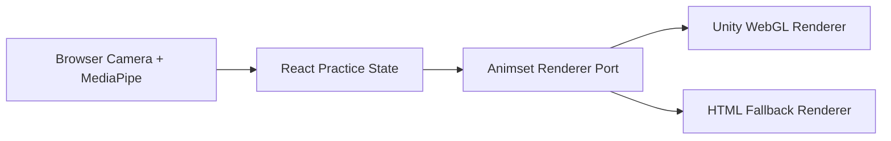
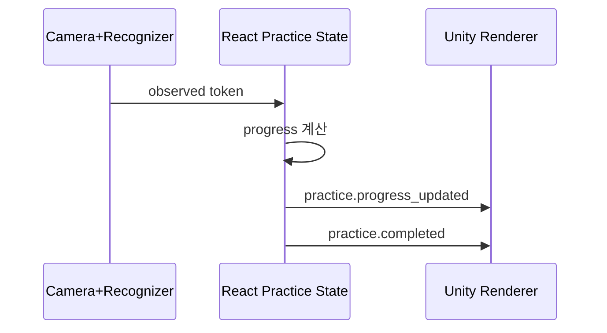
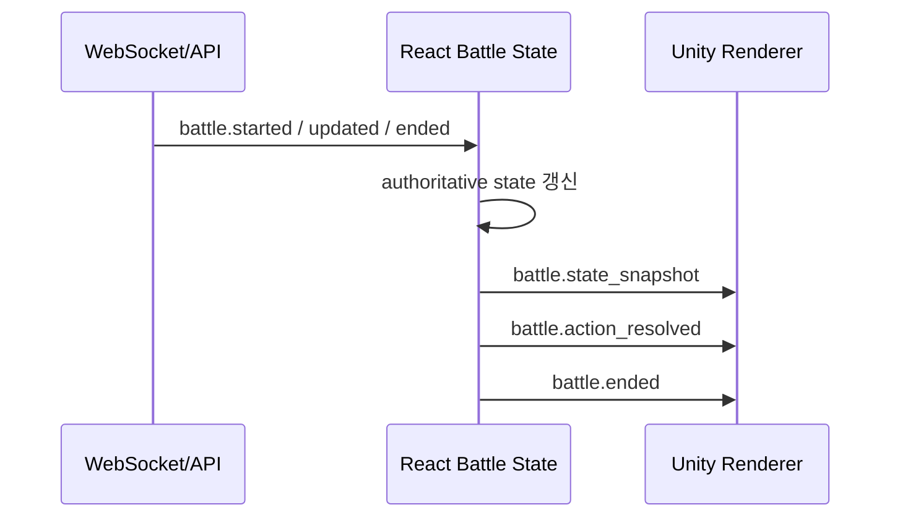

# v6 Unity 연출 통합 명세

## 목적

기존 웹 앱의 practice 흐름을 유지한 채, Unity를 `animset renderer`로 붙여 연습장에서 혼자 스킬을 사용하는 경험을 강화한다. 이 명세의 핵심은 "Unity를 어디까지 붙일 것인가"보다 "지금은 연습장 스킬 이펙트에 집중하고, 전투는 후속으로 둔다"는 우선순위를 고정하는 것이다.

## 핵심 결정

- React는 practice navigation, selected skill, live recognizer orchestration, progress state를 유지한다.
- Unity는 practice scene rendering, camera/VFX/timeline만 담당한다.
- FastAPI battle rule authority는 유지하되, battle Unity integration은 후속 구현계획으로 둔다.
- `animsetId`는 연출 엔진 선택자다.
- `skillId`는 규칙과 연출을 연결하는 canonical key다.

## 비목표

- Unity가 직접 battle action 유효성을 판정하는 구조
- Unity가 WebSocket에 직접 연결하는 구조
- Unity가 브라우저 카메라 recognizer를 직접 소유하는 구조
- Unity가 player profile, rating, history를 저장하는 구조
- v6 현재 단계에서 battle/result Unity 연출을 완성하는 작업
- v6 첫 단계에서 모든 스킬을 3D로 만드는 작업

## 책임 분리

| 층 | 책임 | 예시 |
| --- | --- | --- |
| Backend | 후속 전투 규칙 authority | `gestureSequence -> skill`, mana, cooldown, damage, result |
| Frontend React | 연습 플로우와 상태 orchestration | selected skill, practice progress, camera recognizer status |
| Unity | presentation only | clip 재생, VFX, camera preset, practice completed timeline |

이 원칙 때문에 Unity는 `보기 좋은 발동`을 만들 수는 있어도 `손동작 인식 성공 여부`를 결정하지 않는다. 연습 완료 여부는 React practice state가 결정한다. 전투 결과는 후속 전투 구현에서 backend snapshot이 결정한다.

## 전체 구조



## Renderer Port v1

React는 구체적인 Unity API를 직접 호출하지 않고 renderer port만 본다.

```ts
type AnimsetRendererPort = {
  mount: (target: HTMLElement, options: RendererMountOptions) => Promise<void>;
  unmount: () => void;
  update: (event: RendererEventEnvelope) => void;
  resize?: (width: number, height: number) => void;
  getStatus: () => "idle" | "loading" | "ready" | "error";
};
```

`RendererMountOptions` 에는 최소한 아래 값이 필요하다.

- `animsetId`
- `scene`: 현재 릴리즈는 `"practice"`를 우선 사용한다. `"battle"`과 `"result"`는 후속 구현계획에서 같은 port로 확장한다.
- `buildVersion`
- `fallbackPolicy`

## Event Contract v1

### React -> Unity

| Event type | 목적 | 핵심 payload |
| --- | --- | --- |
| `renderer.bootstrap` | scene 시작 | `scene`, `animsetId`, `playerId`, `opponentId?` |
| `practice.skill_selected` | 현재 연습 술식 반영 | `skillId`, `gestureSequence`, `presentation` |
| `practice.progress_updated` | 연습 단계 갱신 | `currentStep`, `expectedToken`, `observedToken`, `progress`, `status` |
| `practice.completed` | 연습 완료 연출 | `skillId`, `completedAt` |
| `battle.state_snapshot` | 후속 전투 상태 반영 | future scope |
| `battle.action_resolved` | 후속 accepted/rejected timeline | future scope |
| `battle.ended` | 후속 결과 연출 | future scope |

### Unity -> React

| Event type | 목적 | 비고 |
| --- | --- | --- |
| `renderer.ready` | surface 준비 완료 알림 | gameplay state 변경 없음 |
| `renderer.error` | 로더/scene 오류 전달 | React가 fallback 결정 |
| `renderer.asset_missing` | 특정 skill asset 누락 보고 | 기본 timeline으로 대체 |
| `renderer.timeline_complete` | 연출 종료 telemetry | UX 참고용, 판정용 아님 |

Unity -> React 이벤트는 어디까지나 telemetry와 fallback 판단용이다. 이 이벤트가 왔다고 turn이 넘어가거나 result가 확정되면 안 된다.

## Presentation Manifest

새 스킬 추가의 기준점은 코드 분기가 아니라 manifest여야 한다.

```ts
type SkillPresentationEntry = {
  skillId: string;
  animsetId: string;
  tier: "hero" | "standard" | "experimental";
  clipId?: string;
  impactVfxId?: string;
  cameraPresetId?: string;
  posterSrc?: string;
  previewWebmSrc?: string;
  previewMp4Src?: string;
  fallbackMode: "html-only" | "poster" | "video" | "unity";
};
```

원칙:

- `skillId` 는 backend rule key와 동일해야 한다.
- `animsetId` 는 같은 스킬의 다른 연출 버전을 구분한다.
- `clipId` 가 없어도 `fallbackMode` 가 있으면 출시 가능하다.
- GIF는 manifest의 1차 runtime field가 아니다.

## Practice 통합 규칙

practice는 현재처럼 React state가 진행을 소유한다.



규칙:

- Unity는 `현재 연습 술식`을 시각화한다.
- Unity는 `저장된 매칭 로드아웃`을 덮어쓰지 않는다.
- 연습 완료 CTA는 기존 React UI가 계속 제공한다.
- Unity load 실패 시 poster/video 또는 HTML fallback으로 즉시 내려온다.
- `practice.completed`가 들어오면 선택한 스킬의 발동 이펙트를 재생한다.
- 이펙트는 너무 빨리 사라지지 않아야 하며, 사용자는 같은 스킬을 반복 연습할 수 있어야 한다.

## Practice 완료 기준

| 항목 | 완료 기준 |
| --- | --- |
| 스킬 선택 | 연습 중인 술식과 저장된 로드아웃이 분리되어 보인다. |
| 손동작 인식 | MediaPipe 관찰 상태와 현재 단계가 표시된다. |
| 이펙트 발동 | sequence 완료 시 Unity 이펙트가 자동 재생된다. |
| 반복 연습 | 발동 후 `연습 초기화` 또는 스킬 재선택으로 다시 시연할 수 있다. |
| fallback | Unity load 실패, asset missing, version mismatch에서도 연습은 계속 가능하다. |

## Future Battle 통합 규칙

battle은 후속 구현계획이다. 연습장 스킬 이펙트가 안정화된 뒤 backend snapshot을 진실로 삼는 전투 연출을 붙인다.



규칙:

- Unity는 최신 snapshot을 기준으로 scene을 재구성한다.
- accepted action만 화려한 skill timeline을 재생한다.
- rejected action은 blocked/failed timeline으로만 표시한다.
- reconnect 후에는 로컬 연출 캐시가 아니라 최신 snapshot을 우선한다.

## 새 스킬 1개 추가 절차

새 스킬 추가는 아래 6단계를 순서대로 밟는다.

1. `backend rule`
`skillId`, `gestureSequence`, `mana`, `damage`, `cooldown`을 backend에 정의한다.

2. `frontend catalog`
프론트 skill catalog와 표시 문구를 backend와 맞춘다.

3. `recognizer token coverage`
필요한 gesture token이 현재 recognizer에서 나오는지 확인한다.
새 token이 필요하면 별도 작업으로 분리한다.

4. `presentation manifest`
`skillId + animsetId` 조합에 대한 clip/vfx/camera/fallback 정책을 추가한다.

5. `Unity asset authoring`
clip, VFX, camera preset, scene binding을 Unity build에 포함한다.

6. `smoke verification`
practice completed effect, repeat practice, no-Unity fallback을 확인한다.

이 순서에서 3번이 빠지면 `연출은 있는데 손동작으로 못 쓰는 스킬`이 생기고, 4번이 빠지면 `규칙은 있는데 Unity에서 빈 화면이 되는 스킬`이 생긴다.

## Fallback 정책

### Unity load 실패

- 즉시 HTML fallback renderer로 전환한다.
- 연습 중이면 카메라 인식, 진행률, 연습 초기화 흐름을 절대 막지 않는다.
- 사용자에게는 `연출 로드 실패, 기본 화면으로 전환` 수준의 짧은 상태만 노출한다.

### Asset missing

- 해당 스킬만 기본 timeline으로 대체한다.
- 앱 전체 renderer를 내리지 않는다.
- telemetry를 남기고 smoke checklist에 포함한다.
- `jjk_sukuna_malevolent_shrine`, `jjk_megumi_chimera_shadow_garden`은 실제 Unity asset이 붙기 전까지 `html-only` fallback으로 고정한다.
- poster/video fallback은 임시 시각 자산이 준비된 뒤 manifest에 명시적으로 추가한다. 코드에서 임의 poster 경로를 추정하지 않는다.

### Version mismatch

- React manifest와 Unity build version이 다르면 Unity renderer를 시작하지 않는다.
- 안전하게 fallback renderer로 시작한다.
- 비교 기준은 React registry의 `buildVersion`과 Unity `build.json`의 `productVersion`이다.
- mismatch는 사용자의 연습 진행, 스킬 재선택, 연습 초기화 흐름을 막지 않는다.

## Future Battle/Result Smoke 기준

전투 Unity integration 착수 후에는 Unity build 또는 HTML fallback 중 어느 renderer를 쓰더라도 아래 이벤트 조합이 깨지면 안 된다.

| 케이스 | 입력 이벤트 | 기대 결과 |
| --- | --- | --- |
| accepted action | `battle.state_snapshot` + `battle.action_resolved(accepted)` | skill timeline 또는 fallback timeline 표시 |
| rejected action | `battle.action_resolved(rejected)` | 성공 연출 대신 blocked/failed 상태 표시 |
| reconnect snapshot | 최신 `battle.state_snapshot` 재전송 | 이전 로컬 연출 캐시보다 snapshot을 우선 |
| ended result replay | `battle.state_snapshot(ENDED)` + `battle.ended` | 결과 하이라이트 또는 fallback summary 표시 |

## 권장 초기 범위

v6 첫 통합은 아래처럼 제한하는 것이 맞다.

- Unity animset 1개
- hero skill 3~4개
- practice scene 1개
- battle scene은 후속 구현계획
- result scene은 후속 구현계획

이 범위를 넘기면 `기술 검증`보다 `콘텐츠 제작`이 먼저 병목이 된다.

## 범위 밖

- Unity 네이티브 앱
- Unity가 직접 매칭 큐와 전투 소켓을 소유하는 구조
- 모든 스킬의 동시 3D 연출
- Unity 내부 recognizer
- GIF 기반 runtime animation source
